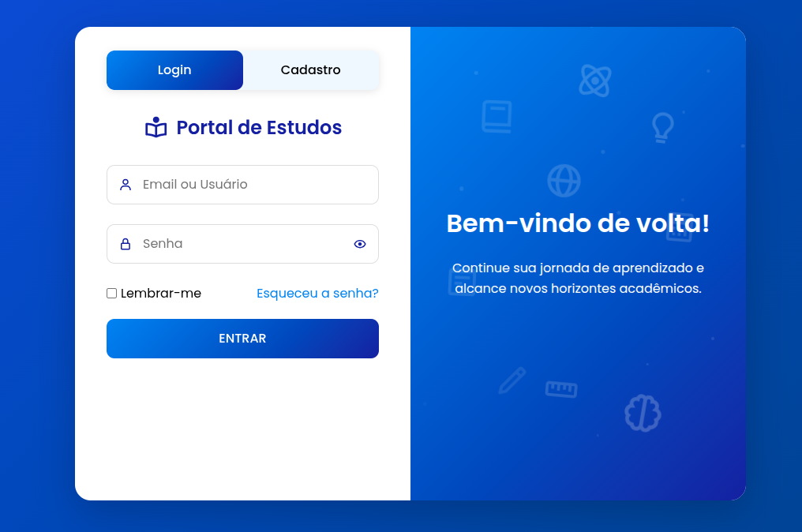

# 🚀 EduSearch - Plataforma Inteligente de Estudos

**EduSearch** é uma plataforma de estudos com IA generativa para orientação automatizada em tópicos educacionais. Desenvolvido como projeto semestral de ADS.



---

## ✨ Funcionalidades Principais
- **🔍 Busca Inteligente por Tópicos**  
  Geração automática de conteúdo educacional via IA (LangChain + Google Generative AI)
- **📚 Níveis de Aprendizado**  
  Materiais organizados em Iniciante/Intermediário/Avançado
- **🤝 Colaboração**  
  Compartilhamento de pastas de estudo entre usuários
- **📝 Sistema de Anotações**  
  Adição de notas personalizadas em cada tópico
- **💬 Chat Interativo**  
  Interface de conversação integrada


---

## 🛠️ Tecnologias Utilizadas

- **Backend**: Laravel 9.x (PHP)  
- **IA**: Python + LangChain + Google Generative AI  
- **Banco de Dados**: MySQL  
- **Infraestrutura**: Docker Compose (Apache, MySQL, Python)  
- **Frontend**: Bootstrap 5 + JavaScript  

---

## ⚙️ Instalação

1. Clone o repositório  
   ```
   git clone https://github.com/arthurbritosouza/EduSearch.git
   cd EduSearch
   ```
2. Copiar o docker-compose.example.yml para docker-compose.yml
   ```
   cp docker-compose.example.yml docker-compose.yml
   ```
3. Coloque sua api key do google no env do docker-compose
   ```
    environment:
    - GOOGLE_API_KEY=<sua_chave_aqui>
   ```
4. Inicie todos os serviços Docker (apenas funciona em distribuição linux)
   ```
   ./dockerUp.sh edusearch
   ```
5. Acesse no navegador  
   ```
   http://0.0.0.0:8078/login
   ```

---

## 🐳 Estrutura do Docker Compose

```
version: '3.8'
services:
  projeto_final:
    build:  
      context: .
      dockerfile: Dockerfile
    container_name: projeto_final
    restart: always
    ports:  
      - "8078:80"
    volumes:
      - .:/var/www/html
    environment:
      - API_ENDPOINT=http://api:8001
    networks:
      - projeto_final_network

  api:
    build:
      context: ./python_final
      dockerfile: Dockerfile
    container_name: api
    restart: always
    ports:
      - "8001:8001"
    volumes:
      - ./python_final:/var/www/html/api
    environment:
      - GOOGLE_API_KEY=<sua_chave_aqui>
    networks:
      - projeto_final_network

  db:
    image: mysql:8.0
    container_name: projeto_final_db
    restart: always
    ports:
      - "3307:3306"
    environment:
      MYSQL_ROOT_PASSWORD: 7877
      MYSQL_DATABASE: projeto_final
    volumes:
      - db:/var/lib/mysql
    networks:
      - projeto_final_network
    
  phpmyadmin:
    image: phpmyadmin/phpmyadmin:latest
    restart: always
    depends_on:
      - db
    environment:
      PMA_HOST: db
    ports:
      - "89:80"
    networks:
      - projeto_final_network

networks:
  projeto_final_network:
    driver: bridge

volumes:
  db:
    driver: local
      
```

---

🎉 Obrigado por conferir o **EduSearch**!